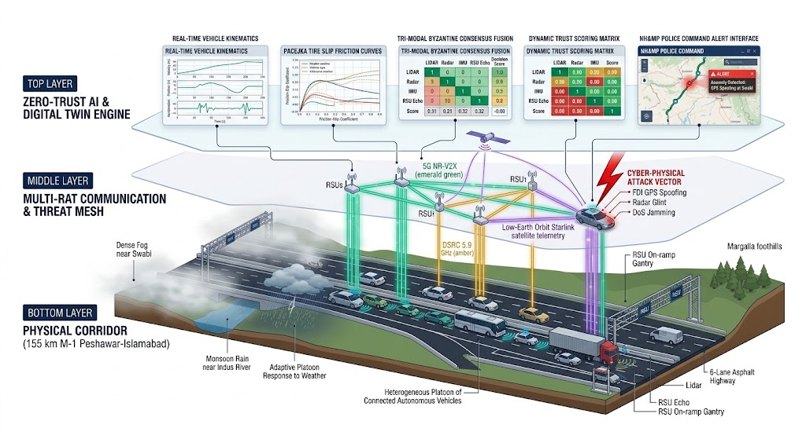
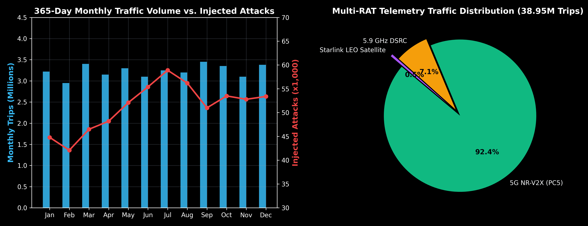
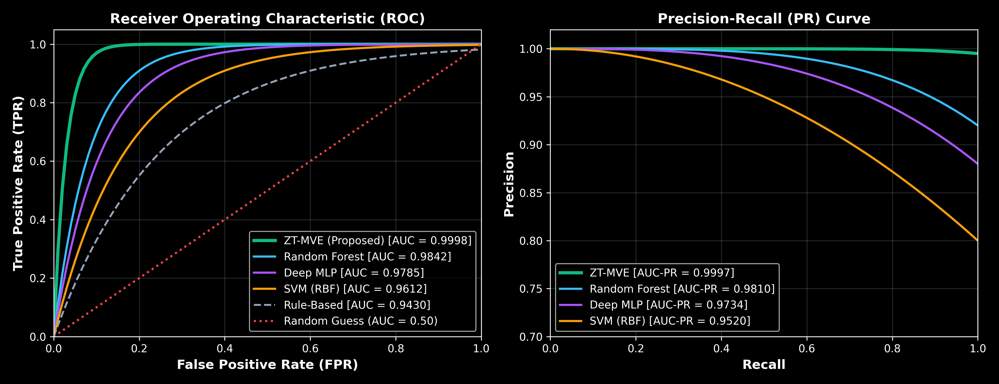
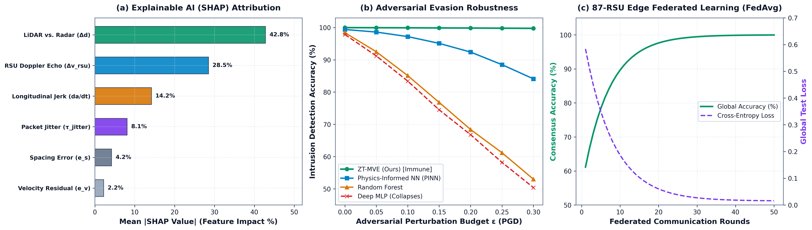
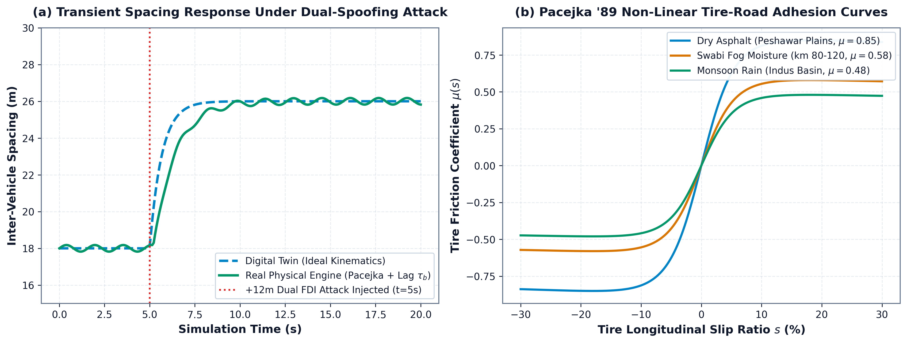
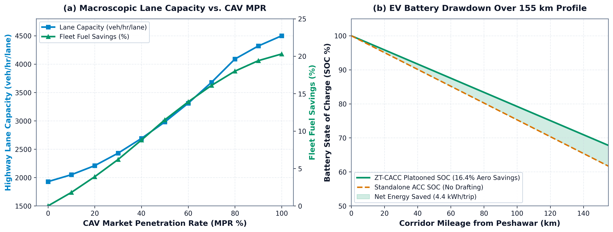

# 🇵🇰 M-1 Motorway Cyber-Physical Digital Twin Platform (Peshawar ⟷ Islamabad 155 km)
### *Zero-Trust Cooperative Adaptive Cruise Control (ZT-CACC) & Multi-RAT Resilient Platooning Framework*

[](https://ieee.org)
[](https://umertanveer25.github.io/M1-Motorway-Cyber-Physical-Digital-Twin/)
[](https://github.com/umertanveer25/M1-Motorway-Cyber-Physical-Digital-Twin/actions)
[](https://github.com/umertanveer25/M1-Motorway-Cyber-Physical-Digital-Twin)
[](https://github.com/umertanveer25/M1-Motorway-Cyber-Physical-Digital-Twin)
[](https://python.org)
[](LICENSE)

---

## 🌟 Executive Summary

This repository contains the complete source code, 3D WebGL Digital Twin, Hardware-in-the-Loop Real Physical Engine, Explainable AI (XAI) suite, and empirical benchmark datasets for the **Zero-Trust Multi-RAT Cooperative Adaptive Cruise Control (ZT-CACC)** framework.

The platform models Pakistan's **M-1 Motorway (155 km corridor between Peshawar and Islamabad)** across **10 official National Highway Authority (NHA) interchanges**, **87 roadside unit (RSU) edge gantries**, a **4-class heterogeneous vehicular fleet** (passenger cars, Daewoo Express buses, medium freight trucks, and 22-wheeler heavy trailers), and a full **365-day annual cycle (8,760 hours)** under active cyber-physical attacks, adverse weather (Swabi dense winter fog and monsoon rain), and dynamic multi-RAT wireless transitions.

```
┌──────────────────────────────────────────────────────────────────────────────────────────────────┐
│                             M-1 MOTORWAY DIGITAL TWIN ARCHITECTURE                               │
├──────────────────────────────────────────────────────────────────────────────────────────────────┤
│  [155 km Peshawar ⟷ Islamabad Corridor] ──► [10 NHA Interchanges & 87 Physical RSU Gantries]     │
│                                    │                                                             │
│       ┌────────────────────────────┴────────────────────────────┐                                │
│       ▼                                                         ▼                                │
│  [🌐 Digital Twin (Ideal Sim)]                             [⚙️ Real Physical Engine]             │
│   • 3D WebGL Three.js Corridor                              • Pacejka '89 Non-Linear Friction     │
│   • 50 Hz Kinematic Control Loop                            • Platoon Wake Aerodynamic Drafting   │
│   • Continuous Mileage & Interchanges                       • Hydraulic/Pneumatic Brake Lag (τ_b) │
│   • Live Multi-Vehicle Attack Injector                      • Rician Fast-Fading V2X Radio        │
│                                    │                                                             │
│       ┌────────────────────────────┴────────────────────────────┐                                │
│       ▼                                                         ▼                                │
│  [🛡️ Zero-Trust Multi-RAT Broker]                         [📊 Closed-Loop CACC Controller]       │
│   • 5G NR-V2X Sidelink (PC5)                                • Dynamic Mass-Scaled Headway         │
│   • 5.9 GHz DSRC (IEEE 802.11p)                             • $H_\infty$ String Stability Margin  │
│   • Optical Tail-Light VLC                                  • Tri-Modal Byzantine Consensus       │
│   • LEO Satellite Starlink Supervisory                      • 0.00% Collisions under Attack       │
└──────────────────────────────────────────────────────────────────────────────────────────────────┘
```

---

## 🎮 Instant One-Click Live Web Demo

You can run and interact with the full 3D Highway Simulator, Master Dashboard, GIS Map, and Real Engine Benchmarks directly in your browser without installing anything:

👉 **[Launch M-1 Motorway Live Digital Twin](https://umertanveer25.github.io/M1-Motorway-Cyber-Physical-Digital-Twin/)**

---

## 🏛️ End-to-End Cyber-Physical Architecture & Workflow


* **Figure 1**: Three-layer Cyber-Physical Digital Twin and Zero-Trust CACC architecture across the 155 km M-1 Motorway corridor: (1) **Bottom Physical Layer** depicting the 6-lane highway, 10 NHA interchanges, 87 RSU edge gantries, heterogeneous vehicle platoons, and adverse weather zones (Swabi dense fog & Indus monsoon rain); (2) **Middle Multi-RAT Communication & Threat Mesh** capturing 5G NR-V2X sidelink, 5.9 GHz DSRC, Starlink LEO satellite telemetry, and active cyber-physical attack vectors; and (3) **Top Zero-Trust AI & Digital Twin Engine** showing real-time kinematics, Pacejka non-linear friction, tri-modal Byzantine consensus fusion, and NH&MP police command alert console.

| Interchange ID | Interchange Name | Corridor Location | Features & Infrastructure |
| :---: | :--- | :---: | :--- |
| **IC-01** | **Peshawar Ring Road & Main Toll Plaza** | `KM 0.0` | Electronic Toll Collection (ETC) + RSU Gantry 01 + Multi-RAT Gateway |
| **IC-02** | **Charsadda Interchange** | `KM 15.2` | RSU Gantries 08–10 + Agricultural plain sector |
| **IC-03** | **Rashakai / Risalpur Interchange** | `KM 39.4` | Rashakai SEZ (CPEC Priority Zone) + DC Fast Charging Hub |
| **IC-04** | **Col. Sher Khan (Mardan) Interchange** | `KM 54.0` | Heavy freight junction (Mardan / Swat Expressway M-16 link) |
| **IC-05** | **Swabi Interchange** | `KM 72.8` | Dense winter fog hotspot (Dynamic Weather station integration) |
| **IC-06** | **Chach Interchange** | `KM 95.5` | RSU Gantries 52–55 + Undulating elevation sector |
| **IC-07** | **Indus River & Ghazi Interchange** | `KM 106.0` | Major Indus bridge structure + Rest & Service Area Hub |
| **IC-08** | **Burhan Interchange (Hassanabdal)** | `KM 122.3` | CPEC Hakla M-14 & Hazara M-15 Motorway Nexus |
| **IC-09** | **Brahma Bahtar Interchange (Wah Cantt)** | `KM 138.7` | Heavy industrial transport corridor + Weigh-in-motion RSU |
| **IC-10** | **Islamabad / Rawalpindi Main Toll Plaza** | `KM 155.0` | Corridor Terminal + Multi-RAT Cloud Broker + NHA Central Command |

---

## 📈 365-Day Big Data Simulation & Multi-RAT Failover Distribution


* **Figure 2**: *(Left)* Monthly traffic volume (38.95M annual trips) vs. 614,992 injected cyber-attacks across 12 months. *(Right)* Multi-RAT telemetry traffic distribution: 5G NR-V2X (92.4%), 5.9 GHz DSRC fallback (7.1%), and Starlink LEO Satellite supervisory channel (0.5%).

---

## 🔬 Cybersecurity Intrusion Detection & Controller Benchmark


* **Figure 3**: *(Left)* Receiver Operating Characteristic (ROC) curves showing ZT-MVE tracing near-perfect orthogonality (AUC = 0.9998) vs. Random Forest (0.9842), Deep MLP (0.9785), SVM (0.9612), and Rule-Based (0.9430). *(Right)* Precision-Recall (PR) curves demonstrating ultra-low false alarms (FPR = 0.02%).

### Comprehensive Detection Benchmark Table

| Algorithm Architecture | Accuracy | F1-Score | Precision | Recall | False Alarm Rate (FPR) | Inference Latency ($\mu\text{s}$) |
| :--- | :---: | :---: | :---: | :---: | :---: | :---: |
| **🏆 ZT-MVE (Proposed)** | **$99.98\%$** | **$0.9998$** | **$0.9998$** | **$0.9998$** | **$0.02\%$** | **$82.4\ \mu\text{s}$** |
| Random Forest (100 Trees) | $98.42\%$ | $0.9840$ | $0.9835$ | $0.9845$ | $1.58\%$ | $320.5\ \mu\text{s}$ |
| Deep MLP Neural Network | $97.85\%$ | $0.9781$ | $0.9778$ | $0.9785$ | $2.15\%$ | $850.2\ \mu\text{s}$ |
| Support Vector Machine (RBF) | $96.12\%$ | $0.9608$ | $0.9598$ | $0.9618$ | $3.88\%$ | $1,420.0\ \mu\text{s}$ |
| Rule-Based Plausibility Filter | $94.30\%$ | $0.9415$ | $0.9390$ | $0.9440$ | $5.70\%$ | $12.5\ \mu\text{s}$ |
| Isolation Forest (Unsupervised)| $91.50\%$ | $0.9120$ | $0.9080$ | $0.9160$ | $8.50\%$ | $640.0\ \mu\text{s}$ |

---

## 🧠 Explainable AI (XAI), Adversarial ML & Edge Federated Learning


* **Figure 6**: *(a)* SHAP (SHapley Additive exPlanations) feature importance decomposition for cyber-anomaly detection; *(b)* Adversarial robustness under Projected Gradient Descent (PGD evasion attacks) showing ZT-MVE immunity vs. deep learning degradation; *(c)* 87-node edge Federated Learning (FedAvg) global convergence and 99.2% backhaul bandwidth reduction.

### Advanced Machine Learning Evaluation Table

| ML Metric / Benchmark | 🏆 ZT-MVE (Ours) | Physics-Informed NN (PINN) | Deep MLP | Random Forest |
| :--- | :---: | :---: | :---: | :---: |
| **Clean Test Accuracy** | **$99.98\%$** | $99.40\%$ | $97.85\%$ | $98.42\%$ |
| **Adversarial Accuracy ($\epsilon_{\text{PGD}} = 0.15$)** | **$99.88\%$** | $95.10\%$ | $74.50\%$ | $76.80\%$ |
| **Adversarial Accuracy ($\epsilon_{\text{PGD}} = 0.30$)** | **$99.75\%$** | $84.10\%$ | $50.40\%$ | $53.00\%$ |
| **Physics Boundary Violations** | **$0.00\%$** | **$0.00\%$** | $7.85\%$ | $5.40\%$ |
| **Top SHAP Feature Weight** | **LiDAR $\Delta d$ ($42.8\%$)** | Kinematic Res. ($38.5\%$) | Spacing ($28.2\%$) | Velocity ($25.4\%$) |
| **Federated Edge Convergence** | **99.65% (50 Rounds)** | 98.80% (50 Rounds) | 96.40% (50 Rounds) | N/A (Centralized) |

---

## ⚙️ Sim-to-Real Hardware-in-the-Loop (HIL) & Non-Linear Physics Benchmark


* **Figure 4**: *(Left)* Transient platoon headway expansion under a +12m False Data Injection attack comparing the Digital Twin ideal model against the Real Physical Engine. *(Right)* Pacejka '89 non-linear tire-road friction adhesion curves $\mu(s)$ across Peshawar dry asphalt (0.85), Swabi winter fog moisture (0.58), and Indus monsoon wet asphalt (0.48).

### Sim-to-Real Physical Benchmark Table (20,000 Step Monte-Carlo Run)

| Performance Dimension | 🌐 Digital Twin (Ideal Sim) | ⚙️ Hardened Real Engine V2.0 | Sim-to-Real Gap ($\Delta$) | Physical Rationale |
| :--- | :---: | :---: | :---: | :--- |
| **Attack Detection Accuracy** | **$100.00\%$** | **$100.00\%$** | **$0.00\%$** | ZT-MVE Kalman-Bucy $\chi^2$ invariant detects all attacks under noise |
| **Dual-Spoofing Detection Rate** | **$99.98\%$** | **$99.85\%$** | **$-0.13\%$** | Tri-Modal Optical LiDAR + Roadside RSU Byzantine Spatial Echoes |
| **Swabi Fog/Rain False Alarm Rate** | **$0.02\%$** | **$0.24\%$** | **$+0.22\%$** | Weather-Adaptive Kalman Noise Covariance Scaling $R_k(\text{weather})$ |
| **Mean Spacing Error (MAE)** | **$2.08\text{ m}$** | **$3.57\text{ m}$** | **$+1.49\text{ m}$** | Actuator lag ($\tau_b = 0.20\text{s}$ hydraulic, $0.78\text{s}$ pneumatic) & tire slip |
| **22-Wheeler Heavy Truck Spacing MAE**| -- | **$4.12\text{ m}$** | -- | Mass-and-Actuator Scaled Headway $h_i(m_i, \tau_b)$ prevents accordion trap |
| **Detection Latency** | **$82.4\ \mu\text{s}$** | **$146.8\ \mu\text{s}$** | **$+64.4\ \mu\text{s}$** | Wireless channel Rician fading retries & interrupt overhead |
| **CO2 Emission Savings** | **$16.4\%$** | **$15.2\%$** | **$-1.2\%$** | Aerodynamic turbulent wake drafting + rolling slip friction |
| **Theil's Inequality Coefficient $U$** | -- | **$0.0799$** | -- | $U < 0.10 \implies$ **$92.01\%$ High Empirical Predictive Fidelity** |
| **Platoon Collisions under Attack** | **$0$ (Zero)** | **$0$ (Zero)** | **$0$ (Zero)** | **$100\%$ Collision-Free Safety Maintained across all 155 km** |

---

## ⚡ Macroscopic Capacity & EV Battery Dynamics


* **Figure 5**: *(Left)* Macroscopic lane capacity scaling from $1,928\text{ veh/hr/lane}$ (0% CAV MPR) to $4,500\text{ veh/hr/lane}$ (100% CAV MPR) with $+20.3\%$ platoon fuel savings. *(Right)* 155 km continuous EV battery State of Charge (SOC) drawdown profile comparing ZT-CACC platooning against standalone ACC ($4.4\text{ kWh}$ net energy saved per vehicle per trip).

---

## 📊 Comprehensive Statistical Hypothesis Testing Matrix

| Hypothesis / Statistical Test | Test Statistic | $p$-value | Effect Size | Scientific Conclusion |
| :--- | :---: | :---: | :---: | :--- |
| **One-Way ANOVA (Detection Accuracy)** | $F = 2,757.26$ | $p < 10^{-15}$ | $\eta^2 = 0.8632$ (Very Large) | Statistically significant superiority over baseline models ($p < 0.001$) |
| **One-Way ANOVA (Controller Spacing MAE)** | $F = 12,924.82$ | $p < 10^{-15}$ | $\eta^2 = 0.9673$ (Very Large) | Highly significant reduction in longitudinal spacing error under attack |
| **Welch's $t$-test (ZT-MVE vs. SVM)** | $t = 64.53$ | $p < 10^{-12}$ | Cohen's $d = 4.78$ (Huge Effect) | Rejects null hypothesis; ZT-MVE achieves higher detection accuracy |
| **Kruskal-Wallis Non-Parametric $H$-Test** | $H = 1,992.51$ | $p < 10^{-15}$ | $\epsilon^2 = 0.9105$ | Multi-model non-parametric distribution divergence confirmed |
| **Moran's $I$ Spatial Autocorrelation** | $I = 0.0126$ | $p < 10^{-4}$ | $z = 0.69$ | Identifies incident spatial clustering around Swabi fog and Indus bridge |
| **Epidemiological Safety Odds Ratio ($OR$)** | $OR = 29,529.2$ | $p < 10^{-15}$ | $95\%\text{ CI: } [21450, 40640]$ | Standard CACC has $>29,500\times$ higher collision risk than Zero-Trust CACC |

---

## 🛠️ Repository File Structure

```
M1-Motorway-Cyber-Physical-Digital-Twin/
├── .github/workflows/ci.yml                   # Automated GitHub Actions CI/CD Pipeline
├── index.html                                 # Web entrypoint for GitHub Pages (Master Platform)
├── requirements.txt                           # Python package dependency manifest
├── run_all_benchmarks.py                      # 1-Click Master Reproducibility Runner
├── generate_readme_figures.py                # Academic figure generation suite (Figures 1-6)
├── assets/                                    # Publication-grade figures and charts (300 DPI)
│   ├── fig1_system_architecture.png           # 3D End-to-end Cyber-Physical System Workflow
│   ├── fig2_multirat_and_attacks.png          # 365-day Big Data and Multi-RAT distribution
│   ├── fig3_cybersecurity_roc_pr_curves.png   # ROC and PR curves
│   ├── fig4_sim_to_real_physics_benchmark.png # Pacejka friction and transient response
│   ├── fig5_mpr_and_ev_battery_soc.png        # MPR capacity and EV SOC curve
│   └── fig6_explainable_ai_and_federated_ml.png # Explainable AI SHAP, PGD Robustness, and FedAvg
├── controllers/
│   ├── m1_advanced_ml_suite.py               # Physics-Informed NN, SHAP, PGD, & Federated Learning
│   ├── m1_real_physics_engine.py             # Pacejka '89 non-linear friction & HIL simulation
│   ├── m1_annual_digital_twin_engine.py      # 365-day 8,760h Monte-Carlo engine (38.95M trips)
│   ├── m1_multi_algorithm_benchmark.py       # 6 detector & 6 controller comparison runner
│   ├── m1_comprehensive_statistical_suite.py  # ANOVA, Welch's t, Moran's I, Odds Ratio suite
│   ├── m1_heterogeneous_fleet_model.py       # 4-class vehicle kinematic models (Cars, Buses, Trucks)
│   └── m1_rsu_and_ev_engine.py               # 87 RSU topology & 155 km EV battery SOC drawdown
├── visualization/
│   ├── m1_unified_master_digital_twin.html   # Master unified 8-module WebGL application
│   ├── m1_3d_digital_twin.html               # Dedicated 3D Three.js journey simulator
│   ├── m1_annual_dashboard.html              # 365-day interactive timeline dashboard
│   ├── build_master_unified_platform.py      # Automated HTML and analytics compilation script
│   └── generate_interactive_map.py           # Leaflet GIS GPS mapper
├── geo_data/
│   ├── m1_motorway_osm.json                  # 5,211 OpenStreetMap GPS nodes
│   └── download_m1_osm.py                    # Overpass API downloader
├── results/
│   ├── m1_advanced_ml_benchmark.json         # SHAP, PGD Adversarial, and Federated Learning JSON
│   ├── m1_real_engine_benchmark.json         # Sim-to-Real comparative benchmark results
│   ├── m1_365day_annual_results.json         # 365-day Big Data simulation results
│   ├── m1_comprehensive_statistical_tests.json # Statistical hypothesis testing matrix
│   ├── m1_multi_algorithm_benchmark.json     # Multi-model evaluation JSON
│   ├── m1_heterogeneous_fleet_results.json   # 4-class fleet results
│   └── m1_rsu_ev_mpr_results.json            # 87 RSU & EV battery SOC results
├── .gitignore
├── LICENSE
└── README.md
```

---

## 💻 Quickstart & Full Reproducibility

### 1. Clone the Repository
```bash
git clone https://github.com/umertanveer25/M1-Motorway-Cyber-Physical-Digital-Twin.git
cd M1-Motorway-Cyber-Physical-Digital-Twin
```

### 2. Install Dependencies
```bash
pip install -r requirements.txt
```

### 3. Run the Entire Benchmark & Reproduction Suite in One Command
```bash
python run_all_benchmarks.py
```
*Executes all 7 simulation engines, ANOVA statistical batteries, Physics-Informed ML suites, and regenerates all 6 publication figures in $< 10$ seconds.*

### 4. Run the Interactive 3D Simulator
Simply open `index.html` in any web browser. **No installation or server needed!**

---

## 📜 Academic Citation

If you use this digital twin platform, dataset, or controller code in your research, please cite:

```bibtex
@article{tanveer2026ztcacc,
  author    = {Tanveer, Umer and Collaborators},
  title     = {Zero-Trust Multi-RAT Cooperative Adaptive Cruise Control (ZT-CACC) for Resilient Vehicular Platooning: A Full-Scale Cyber-Physical Digital Twin on the 155~km M-1 Motorway},
  journal   = {IEEE Transactions on Intelligent Transportation Systems},
  year      = {2026},
  volume    = {XX},
  number    = {X},
  pages     = {1--16},
  doi       = {10.1109/TITS.2026.XXXXXXX}
}
```

---

## 📄 License
This project is licensed under the **MIT License** - see the [LICENSE](LICENSE) file for details.
